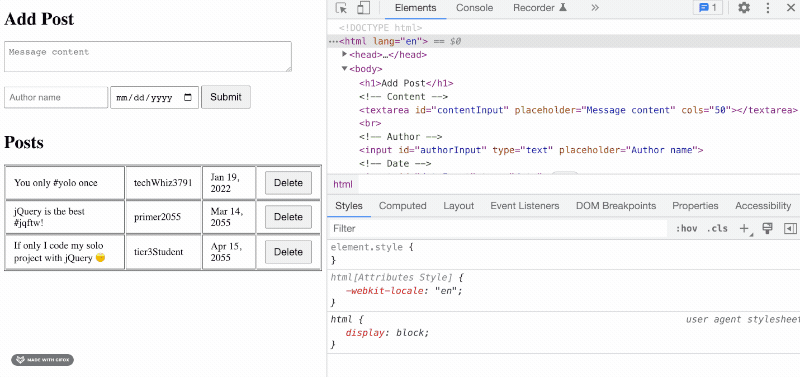
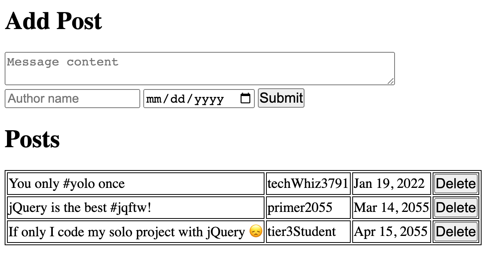
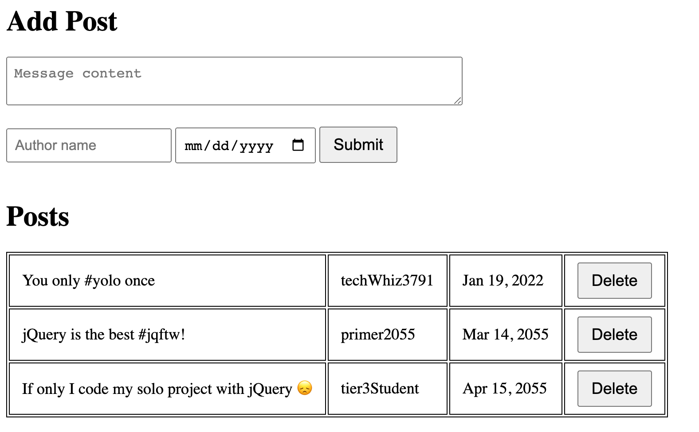
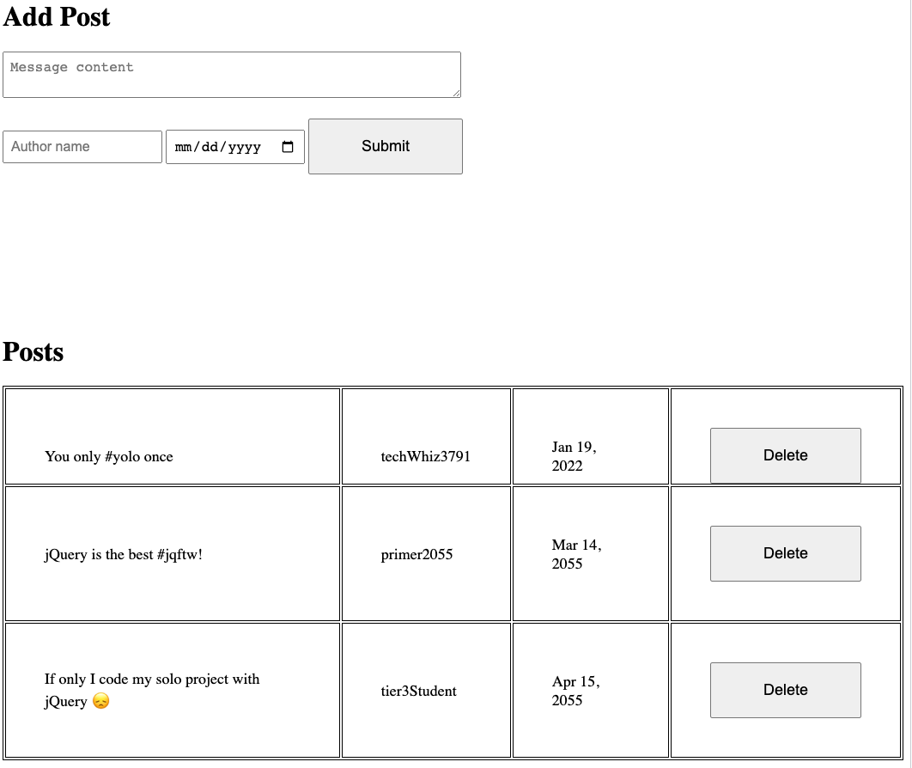
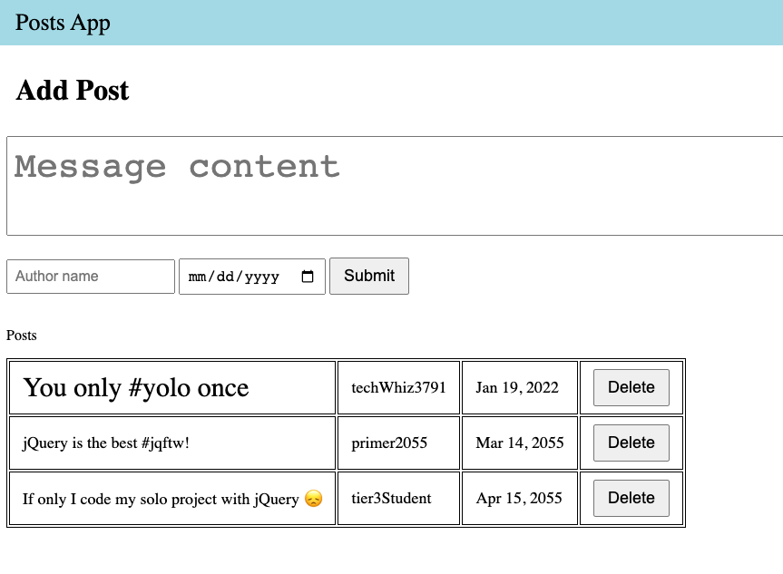
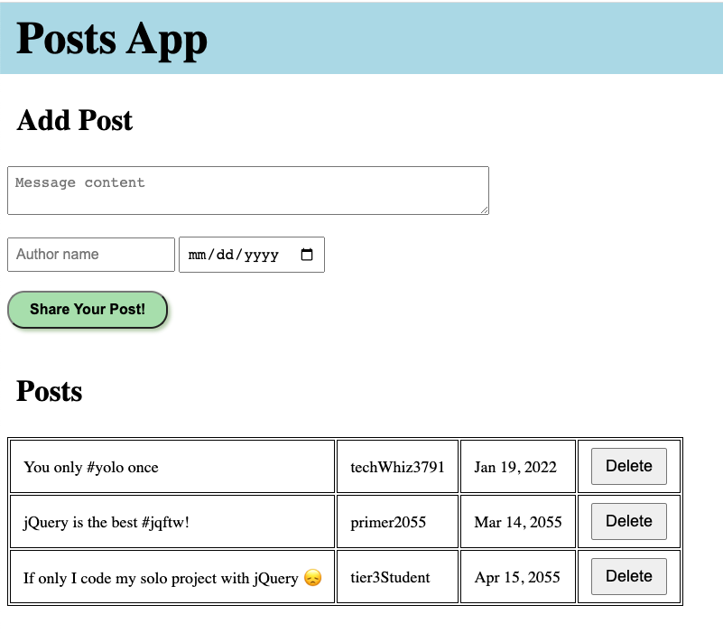
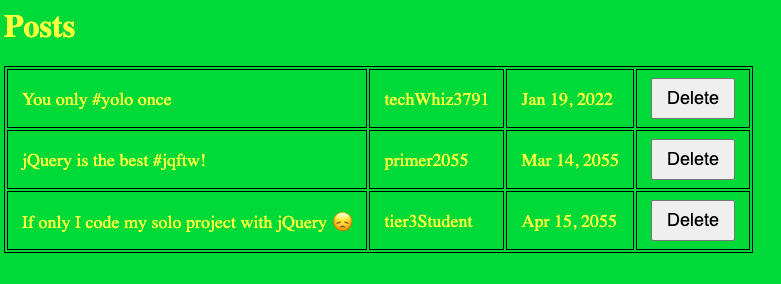
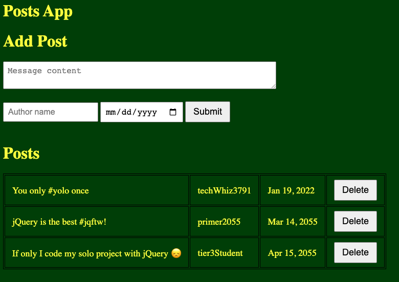

# CSS Basics

**Context**

Design and front-end may or may not be your "thing". But almost _every_ software engineer will need to work on front-ends with CSS at some point.

Coding _beautiful_ websites is not a requirement, but **you will need to design web pages that are usable, accessible, and professional**.


## HTML vs. CSS vs. JS

- HTML is the content
- CSS styles the content
- JS makes the content interactive

CSS works by _targeting_ HTML elements on the DOM, and applying style rules to them.

> Where else have we talking about targeting elements on the DOM....? jQuery! **CSS and jQuery use the same _selectors_ **

## Common Element Selectors

See the [Full Reference at w3schools](https://www.w3schools.com/cssref/css_selectors.asp)

Selector | Example | Description
--- | --- | ---
[element](https://www.w3schools.com/cssref/sel_element.asp) | div | Selects all <div> elements
[.class](https://www.w3schools.com/cssref/sel_class.asp) | .intro | Selects all elements with class="intro"
[#id](https://www.w3schools.com/cssref/sel_id.asp) | #firstName | Selects the element with id="firstName"
[*](https://www.w3schools.com/cssref/sel_all.asp) | * | Selects all elements
[element within another element](https://www.w3schools.com/cssref/sel_element_element.asp) | div p | Selects all <p> elements inside <div> elements
[multiple elements](https://www.w3schools.com/cssref/sel_element_comma.asp) | h1, h2, h3 | select all these elements


## Box Model

If you inspect an element with your browser, you can see a representation of the box model. Everything rendered on the page is a box. These boxes have properties and this is called **The Box Model**.

The parts of the box model are:

- `Content` - The content of the box, where text and images appear.
- `Padding` - Clears an area around the content but inside the element's box. The padding is transparent. Gives us space **inside** the box.
- `Border` - A border that goes around the padding and content
- `Margin` - Clears an area outside the box and border. The margin is transparent. Margin gives us space **between** elements.

## CSS properties to know!

**IMPORTANT: We will not teach you all the CSS properties, tricks, or tools that you will need to know!** 

You will need to ***do your own research!*** 

- margin
- padding
- border
- height
- width
- display (block, inline, flex, grid, none)
- background-color
- font (size, weight, color)

## Block vs. inline

- `display: block` elements take up the entire width of the page
- `display: inline` elements are as wide as they need to be
    - Cannot use padding, margin, width, or height!
- `display: inline-block` elements are as wide as they need to be, but _can_ use padding, margin, width, height. 

## The most common CSS question: HOW DO I CENTER?

Many options to center things. Thats part of the problem. This decision tree is very helpful:

- [Centering In CSS](https://css-tricks.com/centering-css-complete-guide/)

In short:

- `text-align: center` centers the _content_ of the element (text and child elements)
- `margin: 0 auto` centers the element itself, inside of its parent element (must be `block` or `inline-block`)
- Consider flexbox!


## Dev Tools: The Elements Panel

Use the _Elements_ panel in chrome dev tools to help you write and "debug" CSS:



Note that changes in dev tools **do not save** to your actual `.css` file. You will need to manually copy/paste changes.


## Learning Resources

Flexbox and CSS Grid are hard, but also super powerful! These are online "games" to help you learn them:

- [Flexbox Froggy](https://flexboxfroggy.com/)
- [CSS Grid Garden](https://cssgridgarden.com/)


## Padding and Spacing

The number 1 thing you can do to make your website look cleaner and more professional is to **give your elements some space!** Crowded content looks tense, and makes the user feel tense. Loosen up, give your site some room to breath 🌬️


**❌ Bad Example: Too crowded!**




**✅ Good Example: Room to Breathe**



**❌ Bad Example: Too much negative space!**




Every element deserves a bit of padding. But use it in moderation: you want things to feel roomy, but still cohesive.


## Hierarchy of Content

There should be a clear hierarchical structure in your page design. eg:

1. Page Title: biggest / most prominent, `<h1>`
2. Section Title: second biggest, `<h2>`
3. Page content: third biggest, `<p>`

Structuring your design this way helps users understand what they are seeing.

**❌ Bad Example: Confusing Hierarchy**



In this example, it's not immediately clear what each section is for, or what we want the user to look at.


**✅ Good Example: Clear hierarchy**



Notice how the font size and weight changes from the top level title down towards the page content.

As a bonus, we use color here to make the "Share Your Post!" button stand out. The key lesson is to **use typography, color, and layout to draw the users eye in a clear path across the page.**

## Attention to detail

Often as a front-end engineer, your job will be to translate high-fidelity designs (images) into HTML and CSS. The designer and client will expect that your recreation is "pixel perfect". 

Practice paying super close attention to the small details in your apps. This may not be easy at first, but you'll get better with practice 🙂

Here's a fun online game to practice your attention to detail:

[cantunsee.space](https://cantunsee.space/)


# Web Accessibility

As a front-end engineer, you have an ethical and legal responsibility to make your web apps _accessible_. This means that your website are equally usable by _all_ users, including those with varying auditory, visual, physical, or cognitive abilities.

For example, some users may:

- ...use a [screen reader](https://www.afb.org/blindness-and-low-vision/using-technology/assistive-technology-products/screen-readers) to access a website's content (as opposed to a monitor) ([example](https://www.youtube.com/watch?v=XPoHIrLOb7w))
- ...be unable to see contrasting colors as well as you can
- ...use a keyboard exclusively, instead of a mouse

For the most part, browsers do a good job at making websites accessible to all users -- as long as you follow accessibility best practices!

## Color Contrast

In general, light text on a light background is very difficult to read.

Use the [Color Contrast Checker](https://webaim.org/resources/contrastchecker/) from WebAIM to make sure your text is readable at different font sizes.

**❌ Bad Example: Light text on a light background**



**✅ OK Example: Light text on a dark background**




## Semantic HTML

"Semantic HTML" means that your HTML elements help describe the meaning of their content.

For example:

```html
<div>Buy Items<div>
```

vs.

```html
<button type="submit">Buy Items<button>
```

While you can technically attach a `click` event handler to a `<div>`, it is much more clear in the second example that the `<button>` is submitting a form, to buy some items.

Or another example:

```html
<div>Todo List</div>
<p>Mow the lawn</p>
<p>Water the grass</p>
<p>Pull weeds</p>
```

While this might look ok on the screen, it would not be clear to a screen reader that this is a _list_, with a title of "Todo List".

More semantically:

```html
<h1>Todo List</h1>
<ul>
    <li>Mow the lawn</li>
    <li>Water the grass</li>
    <li>Pull weeds</p>
</ul>
```


### Semantic Images

Screen readers cannot parse images. Use an `alt=` attribute to tell the screen reader about the content of the image.

```html

```

### Other Semantic Elements

Do you really need to use a `<div>`? Or is there a more descriptive element available?


See [W3Schools: Semantic Elements](https://www.w3schools.com/html/html5_semantic_elements.asp)