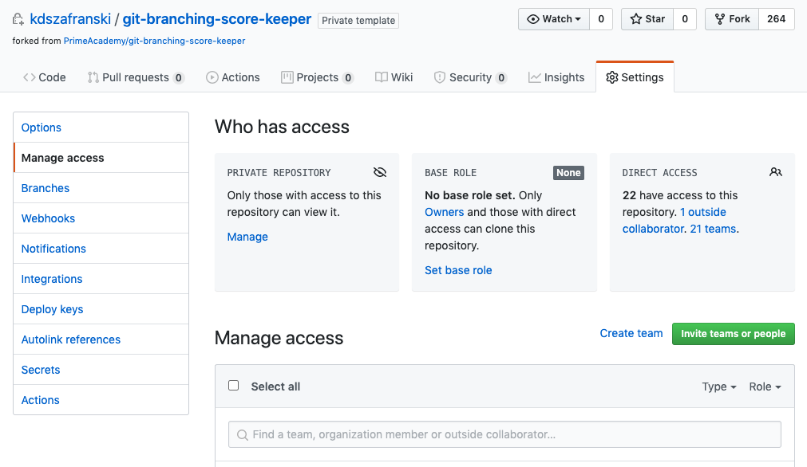
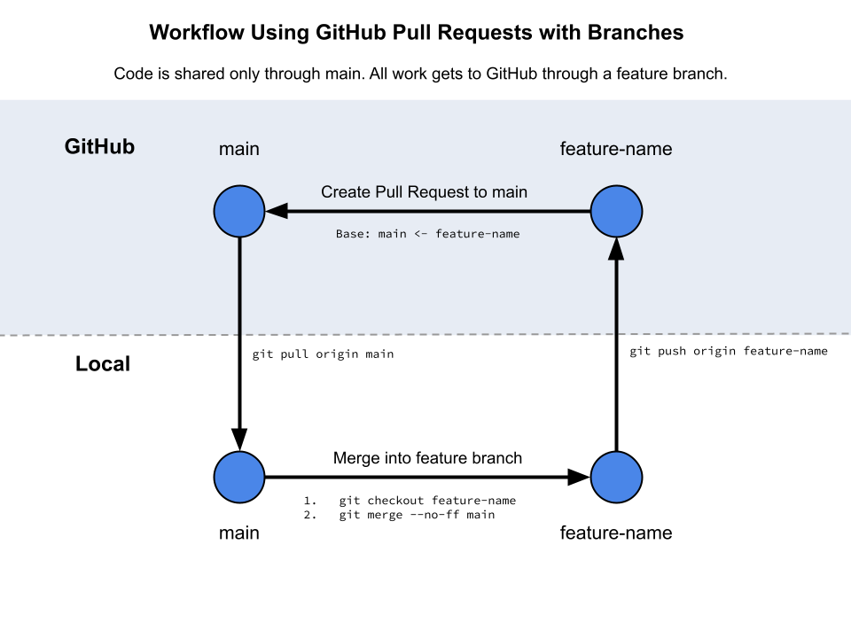

# Branching with Pull Requests

Git is amazing. Github's Pull Request feature makes merging much easier. Pull Requests allow you to focus on the code changes and helps with the merging.

## Git Branching Refresher

Been a while? See the [Git Branching Cheatsheet](git-branching-cheatsheet.md)


## Instructor Notes

- [use git scorekeeper project](https://github.com/PrimeAcademy/git-branching-score-keeper), 
- fork, set up for collaborators (see notes below)
    

### DO

- clone to local machine, open in editor
- assign each task out
- demonstrate doing a feature
    - co -b feature-branch
    - add, commit
- Make PR, assign reviewer
- Approve PR
- git pull origin main to get new code
    - update work in progress feature-branch
        - co feature-branch
        - git merge --no-ff main (merge new updated main into our working branch)
    - make commit

---

## Git Branching Workflow with Github Pull Requests

GitHub Pull Requests allow others to review our code and approve the changes. It essentially replaces the final `merge` of the feature branch back into `main`.

### The first time (project setup)

On your github project repo. Click the `settings` tab and then click `Manage access` in the left-side menu. Add your team members.




## Overview

Code flows to each developer through **main**. All work is done in branches and pushed up to GitHub and then merged into main only through Pull Requests.




## Moving Code to GitHub

### Every time

Make sure the code on your computer is up to the latest version on GitHub by switching to main and pulling down the changes.

```
git checkout main
git pull
```

Create a branch and switch to that branch.

```
git checkout main
git branch feature-NAME
git checkout feature-NAME
```

These three commands are the same as

```
git checkout -b feature-Name main
```

Git add, commit, and push as usual

```
git add .
git commit -m "MESSAGE"
git push origin feature-NAME
```

Repeat this until you are all done with your feature (probably a few commits). When you're done with the feature, it's time to create a Pull Request to merge to `main`.

#### Update your branch w/ changes from main
First, it's important to make sure that your code is up to date with the `main` branch. You will do this by updating your local main branch with what is on GitHub

```
git checkout main
git pull
```

Resolve any conflicts (although, as long as you aren't committing to `main`, you shouldn't have conflicts). Then checkout your own branch and merge main into it with:

```
git checkout feature-NAME
git merge --no-ff main
```

- If there are no conflicts, you will probably be thrown into `ViM` where you can type `esc` then `:wq`. 
- In the event of a merge conflict, look at any impacted files. Make the required changes to make the files look how you would like them to look, and commit them. (the `git commit` without the `-m` here will create a default message which you can accept in `ViM` by typing `esc` then`:wq`)

```
git add .
git commit
git push origin feature-NAME
```

This makes sure your code is all set to be merged into `main` without any conflicts.

Test the application again to make sure the merge did not break any functionality. Make any fixes needed. 

#### GitHub Pull-Request
Now we are ready to merge the feature into the `main` branch. On GitHub, click the `New Pull Request` button. Make sure the `base` is `main` and `compare` is your feature branch.

Click `Create Pull Request` and add a `Reviewer` from your team.

When the reviewer approves the Pull Request, then you may merge the Pull Request into main.

To keep your code up to date on your computer, switch to main and pull down the changes.

```
git checkout main
git pull
```

Repeat.
